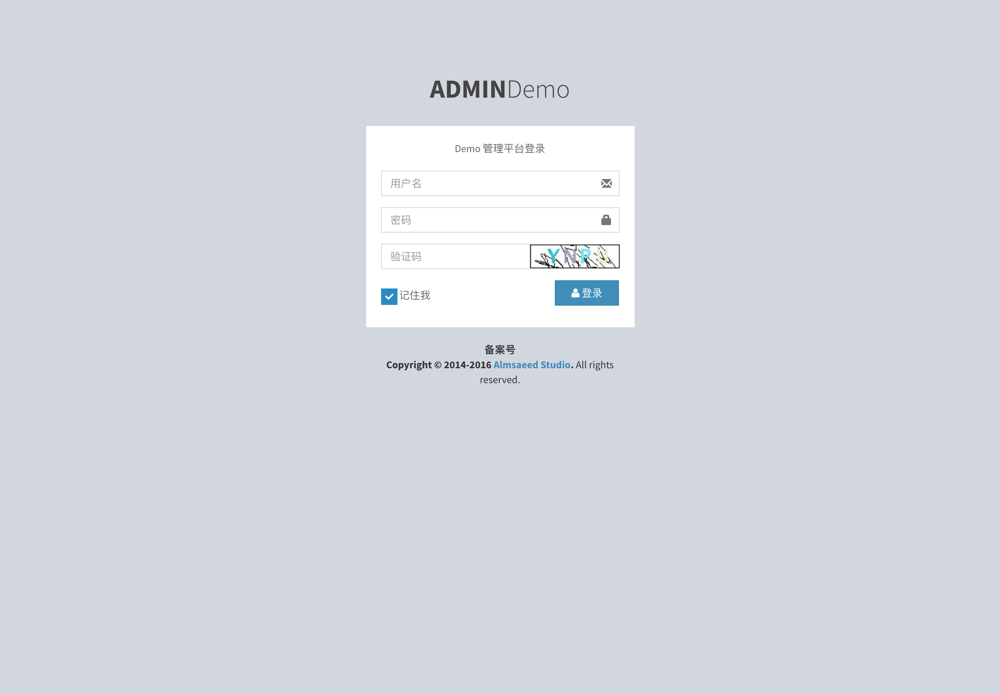
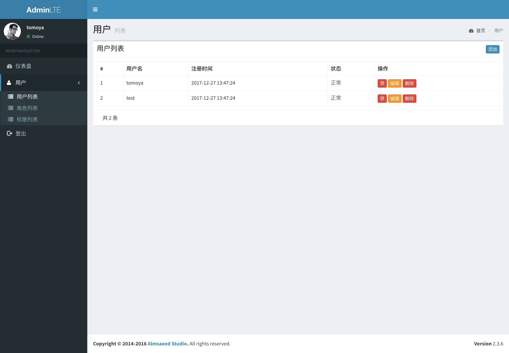
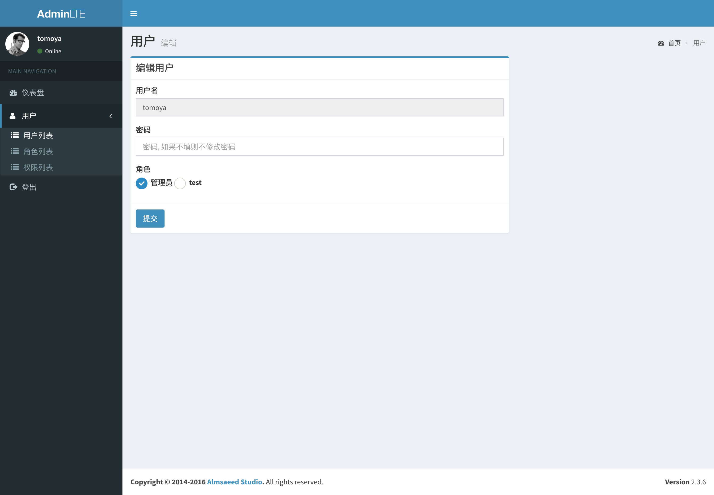
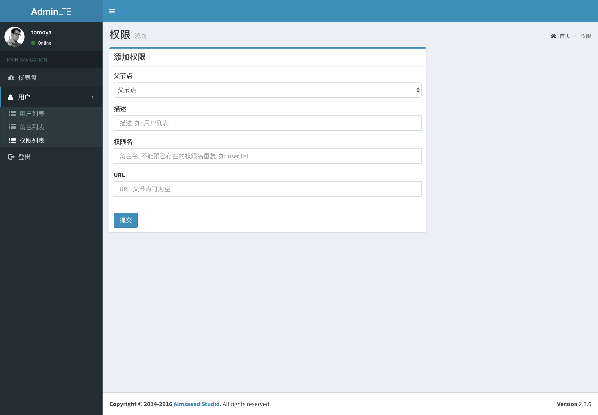
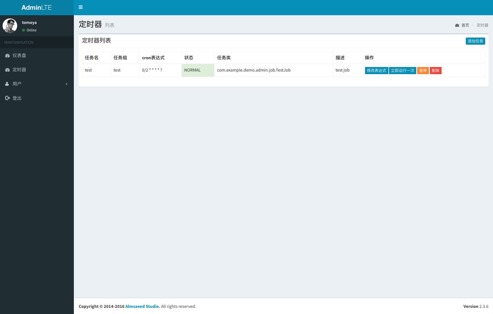

# spring-boot-security-demo
spring-boot + spring-security + quartz 整合后的一个后台框架的空壳

**更新日志**

- 2018-07-13: 加入了quartz后台动态配置功能，相关代码来自项目：https://github.com/davidkiss/spring-boot-quartz-demo

## 启动

- git clone https://github.com/tomoya92/spring-boot-security-demo
- 修改配置文件 `application.yml`
- 创建数据库：spring-boot-security-demo
- 将根目录里的 `quartz.sql` 导入到数据库
- mvn spring-boot:run 程序启动表会自动创建
- 导入数据脚本：`init.sql`
- 重启运行 mvn spring-boot:run
- 访问 http://localhost:8080/
- 用户名: tomoya 密码: 123123
- 用户名: test 密码: 123123

## 技术栈

- spring-boot
- spring-security
- spring-data-jpa
- adminlte
- mysql
- freemarker
- quartz

## 权限结构

用户 角色 多对一
角色 权限 多对多

## 截图

